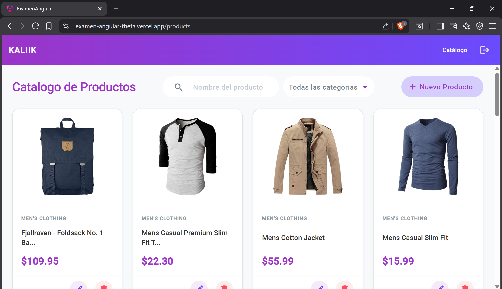

# Kaliik - Angular Product Management

Aplicación Single Page Application (SPA) desarrollada con **Angular 18+** que implementa un sistema CRUD completo para gestión de productos. El proyecto se enfoca en rendimiento, arquitectura limpia y una experiencia de usuario fluida utilizando **Material Design**.

## Características Principales

- **Arquitectura Moderna:** Uso de **Standalone Components**, **Signals** para gestión de estado reactivo y **Control Flow** (`@if`, `@for`).
- **Rendimiento Optimizado:** Estrategia `OnPush` en componentes clave para minimizar ciclos de detección de cambios.
- **Gestión de Estado Híbrida:** Solución inteligente para manejar las limitaciones de *FakeStoreAPI*:
  - Los productos creados/editados se persisten en memoria local (State) para simular una DB real.
  - Generación de IDs locales únicos para evitar conflictos con la API.
- **UI/UX Responsive:** Diseño adaptable (Mobile First) utilizando CSS Grid y Flexbox.
- **Feedback al Usuario:** Indicadores de carga (Spinners), notificaciones (SnackBar) y diálogos de confirmación.

## Stack Tecnológico

- **Framework:** Angular 18
- **Estilos:** SCSS (Sass) + Angular Material
- **API:** [FakeStoreAPI](https://fakestoreapi.com/) y [LoremPicsum](https://picsum.photos/)
- **Gestión de Formularios:** Reactive Forms con Validaciones estrictas.
- **Code Quality:** TypeScript estricto (No `any`), Prettier configurado.

## Instalación y Ejecución

**Requerimientos:**
    Node.js: v20.11.0 o superior (v20 LTS recomendada)
    Angular CLI: v18.0.0 o superior

1. **Clonar o descomprimir el proyecto:**
   cd examen-angular

2. **Instalar dependencias:**
    npm install

3. **Ejecutar servidor de desarrollo:**
    ng serve

    Abrir en el navegador: http://localhost:4200/

4. **Credenciales de Prueba:**
    Puedes encontrar un set de credenciales en el form de login ('¿Olvidaste tus datos?')
    La API acepta cualquiera de estas opciones:

    Usuario: mor_2314
    Contraseña: 83r5^_
    Usuario: kevinryan
    Contraseña: kev02937@

    (Nota: Usualmente el navegador emite una alerta 'Cambia tu contraseña: Tu contraseña fue encontrada en una filtracion de datos' al usar estas credenciales de prueba)

5. **Decisiones de Diseño:**
    - **Manejo de FakeStoreAPI:**
    Dado que la API es de solo lectura (simula POST/PUT pero no guarda los cambios), se implementó un Servicio Inteligente (ProductService) que actúa como una capa de abstracción:

    Intercepta las peticiones de escritura.

    Si el producto es "nuevo" (creado en la sesión), actualiza el Signal local inmediatamente.

    Esto permite al usuario crear, editar y borrar sus propios productos durante la sesión sin recibir errores 404 de la API.

    - **Signals vs RxJS:**
    Se priorizó el uso de Signals para el estado de la vista (listas, loading, filtros) por su simplicidad y rendimiento, manteniendo RxJS (HttpClient, Observable) estrictamente para la comunicación asíncrona con el servidor.

## Aviso Legal y Derechos de Autor

Este proyecto ha sido desarrollado exclusivamente con fines de demostración técnica como parte de una prueba práctica de selección.

Se ha utilizado la identidad visual (logotipo, nombre comercial "Kaliik" y paleta de colores corporativa) para simular un entorno de desarrollo realista.

**Disclaimer:**
- Todos los derechos de propiedad intelectual e industrial sobre la marca **Kaliik**, su logotipo y sus activos de diseño pertenecen a sus respectivos titulares legales.
- Este repositorio **no** tiene afiliación comercial oficial con Kaliik, ni existe intención de lucro o explotación comercial de dichos activos por parte del autor de este código.
- Las imágenes de productos utilizadas son demostrativas (provenientes de *FakeStoreAPI* o *Lorem Picsum*) y no representan productos reales a la venta.

Autor: Alonso Gabino Tello
Desarrollo: 28 - 30 Enero, 2026
Publicación: 30 Enero 2026